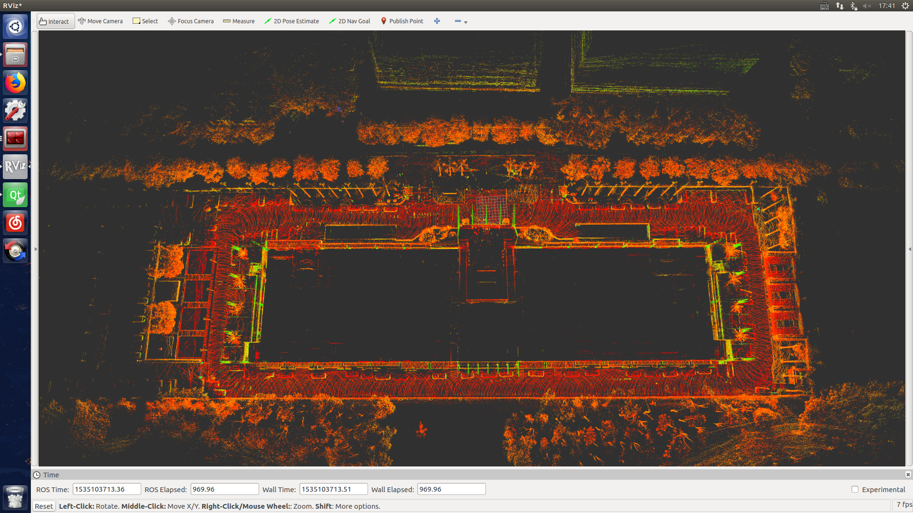

# lidar_slam_3d
## Details
lidar_slam_3d is a ROS package for real-time 3D slam. It is based on NDT registration algorithm. With loop detection and back-end optimization, a map with global consistency can be generated.


## Example
An example map build by vlp-16.  

 

## Requirements
* pcl
* g2o
## Build
  ```shell 
  cd ${catkin_workspace}/src
  git clone https://github.com/ningwang1028/lidar_slam_3d.git
  cd ..
  catkin_make
  ```
## Run 
  ```shell  
  roslaunch lidar_slam_3d lidar_slam_3d.launch  
  ```

